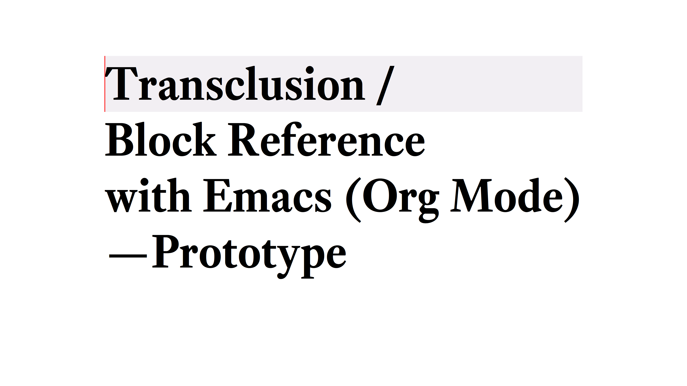

This library is an attempt to enable transclusion with Org Mode in Emacs. It is my take on [the idea by John Kitchin](#Original idea by John Kitchin).

It is still **VERY experimental**. Use it with care if you would like to play with it. It modifies your files (notes), use it with care. The author and contributors cannot be held responsible for loss of important work.

I am no developer or programmer. If you like the idea, and can lend your technical hand, I would be grateful. Here is a [list of things](#) I think needed to be done (I'm sure there are more; let me know other things, too.).

---

# Intended use

I am no developer, or programmer. I am dabbling in the Zettelkasten method, with using [Org-roam](https://www.orgroam.com/). I keep my notes in a repository where I keep the network notes (I guess people call them evergreen, concept, or permanent notes). 

When I start writing something long-form, I want to have a writing project separately from the notes repository, assemble relevant notes to form a basis of the long-form, and avoid having multiple copies of notes flying around.

Transclusion should let me do this.

This 10-minute show & tell on YouTube I did shows you how this library works.

One change from the video is that now you click on the link and transclude the content, the link will disappear; when you deactivate transclusion, the link will be back.

# How to use the library

## Load
Load the file (`load-file`) or open the file and evaluate the whole buffer (`eval-buffer`). It is experimental at the moment.

At this stage, you use a special link type `ortc` (it's defined as a variable, so you can change it to something like `transclusion`). 

## Special link type
There are two types of links you can transclude:

1. file link
2. ID with Org-ID

For files, don't use Org Mode's `file:` link type (not coded to work). Do something like this:

- `ortc:path/to/note.txt`
- `[[ortc:path/to/note.org][my note 1]]`

For ID, do something like this:

- `[[ortc:id:uuid-of-the-heading]]`

## Activate and deactivate
Activate transclusion with `org-transclusion-activate` (it should become a buffer-local minor mode, but it is not at the moment). 

If the variable `org-transclusion-activate-persistent-message` is not changed, you should see a header appear on top of the buffer indicating transclusion is active.

All the `ortc` links in your current buffer should transclude the specified contents, and the links themselves disappear from the buffer (deleted).

Deactivate transclusion with `org-transclusion-deactivate`. This should remove the transcluded contents, and bring back the original link. The header should also disappears.

## Update and save transclusions
Transcluded content is a copy from the transclusion sources. The only difference is that it is under an overlay to indicate that it is a transcluded content. 

The overlay holds the information about the providence. 

The library differentiates `update` and `save` transclusion sources. Update only insert back the edited content, while `save` does update and save the source buffer to file.

Save the current buffer; the hooks will be triggered to save the sources of all the transclusions in the current buffer.

When you switch to another buffer, two things should happen:
1. Transcluded contents disappear
2. The sources get updated (but not saved)

When you come back to the transclusion buffer, the contents should come back automatically.

## Work with transclusions at-point and all for the buffer interactively
The following operations can be done interactively. 

"Add" is the operation of including; that is, copy-and-pasting contents from the source, and put an overlay in the region.

For at-point
- Add (via opening the link / clicking the link)
- Update source
- Remove
- Detach

For the entire buffer
- Add all
- Update source all
- Remove all

Note that there is no detach function for the buffer.

## Working with transclusions manually while transclusion is inactive
You might notice that you can do most of the operations without activating transclusion for the buffer. This is mainly because I have not thought through what I want to do when transclusion is inactive.

The difference is the automatic toggle when moving the focus, and automatic save buffer at the moment.

I think that the inactive state can be used as "read-only" mode, or "export" mode. But that needs to be a consideration for future iterations, after I validate the fundamentals of save-buffer for multiple source buffers.

# List of things to be done

- [ ] Validate the fundamental idea / architecture, especially modifying and saving the transclusion sources
   
   I took the modifying logic from `org-edit-src` (`-save` and `-exit` more specifically). This may not be the best of ideas given that this part of code modifies people's notes (outcome of hard intellectual work). 
   
   I made the `save-buffer` part so that Emac's backup facility will be turned on for the local-buffer when you have it turned off. This backup does not seem to be assuring enough; however, making multiple versions of backup files might clutter your notes repository. 
   
- [ ] Turn the activation / deactivation into a buffer-local minor mode
  I just don't know how (yet) -- there is good in-system documentation, so it should be a matter of focus reading and playing with. If someone out there who can "just do it", that would be very helpful.

- [ ] Ensure export works
  What's the point of writing up a long-form material (article, academic paper, book chapter, etc.) and you cannot export it outside Emacs? Because transclusions are "temporary copy" with just links in the files, I am not sure export functions work correctly. I am guessing Org Mode's export functions look at the buffer, so it should export the transcluded regions. I also have Pandoc Mode in mind, when you put together multiple files/buffers to form a material. This needs validation, and if it does not work, then a solution.

- [ ] Consider cycling "Edit" -> "Read-only" modes, perhaps?
  I think it is related to the export function. I had an idea to make the transclusions read-only as well as edit mode. When read-only mode is on, you cannot edit the transcluded content, but it will remain on the buffer even if you change the focus away from it. I think the read-only content should be removed on save hooks like the editable ones.

- [ ] Consider a good use of mode when transclusion is inactive
  I have not thought it through yet. When transclusion is inactive, you can still transclude contents manually clicking on the link. You can use `update-src`, `remove-` or `detach-at-point` commands interactively. When inactive, transclusion does not toggle, update, or save source buffers automatically.

- [ ] Make `update-at-point` accept `C-u` or something to turn on save
  I just could not work out the way to pass the optional `savebuf` argument to `org-transclusion-update-src-at-point`. I could make a wrapper command `org-transclusion-save-src-at-point`; I was not sure if that's desirable.

- [ ] Make UX/UI more writer-friendly (e.g face for the overlay)
I didn't have enough knowledge how defining faces work. 
If we also have edit and read-only mode, I think it makes sense to have different colors on the overlay to indicate they are different. 

I also like the idea of using gutter (like the `git-gutter` package). 

- [ ] Add visual queue to the source buffer
One of the UI/UX improvements. I think the source buffer should also visually indicate that there is an active transclusion for the buffer or element (headline). For this, using the gutter would add a subtle and yet sufficient visual indication, I think. 

Since the `org-transclusion--yank-source-to-target` visits the source buffer, it should be possible to do something with it.

# Original idea by John Kitchin
https://github.com/alphapapa/transclusion-in-emacs#org-mode

> {O} transcluding some org-elements in multiple places
> [2016-12-09 Fri] John Kitchin asks:
>
> I have an idea for how I could transclude “copies” or links to org-elements in multiple places and keep them up to date. A prototypical example of this is I have a set of org-contacts in one place, and I want to create a new list of people for a committee in a new place made of “copies” of the contact headlines. But I do not really want to duplicate the headlines, and if I modify one, I want it reflected in the other places. I do not want just links to those contacts, because then I can not do things with org-map-entries, and other org-machinery which needs the actual headlines/properties present. Another example might be I want a table in two places, but the contents of them should stay synchronized, ditto for a code block.
>
> This idea was inspired by https://github.com/gregdetre/emacs-freex.
>
> The idea starts with creating (wait for it…) a new link ;) In a document where I want to transclude a headline, I would enter something like:
>
> transclude:some-file.org::*headline title
>
> Then, I would rely on the font-lock system to replace that link with the headline and its contents (via the :activate-func link property), and to put an overlay on it with a bunch of useful properties, including modification hooks that would update the source if I change the the element in this document, and some visual indication that it is transcluded (e.g. light gray background/tooltip).
>
> I would create a kill-buffer hook function that would replace that transcluded content with the original link. A focus-in hook function would make sure the transcluded content is updated when you enter the frame. So when the file is not open, there is just a transclude link indicating what should be put there, and when it is open, the overlay modification hooks and focus hook should ensure everything stays synchronized (as long as external processes are not modifying the contents).
>
> It seems like this could work well for headlines, and named tables, src blocks, and probably any other element that can be addressed by a name/ID.

