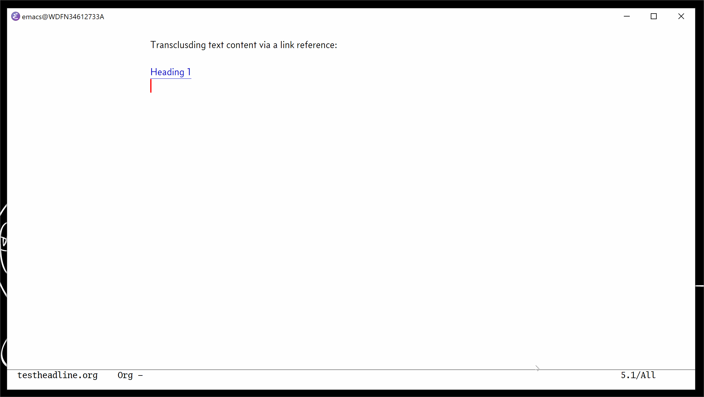
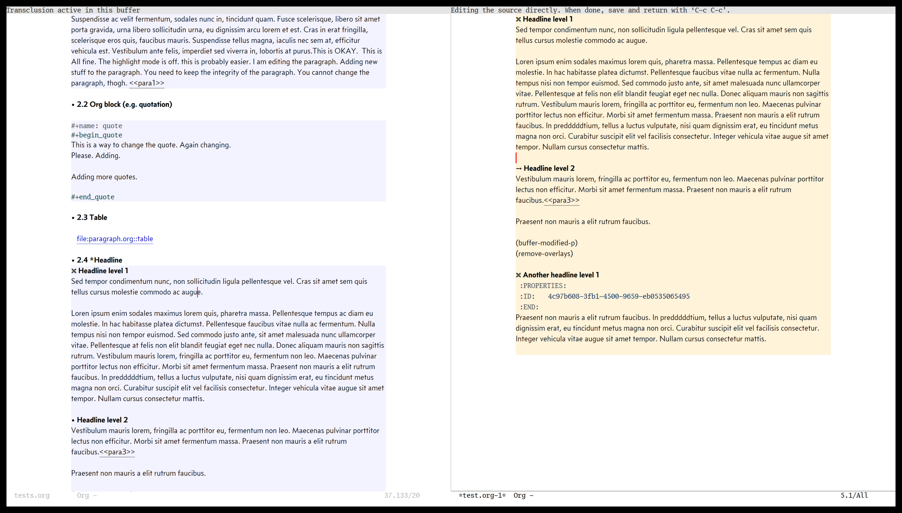
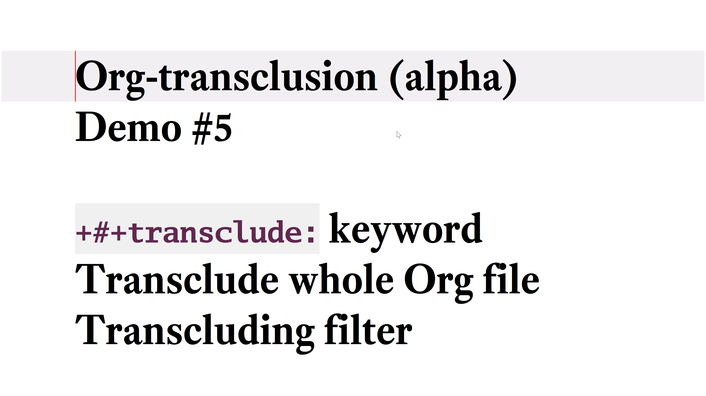
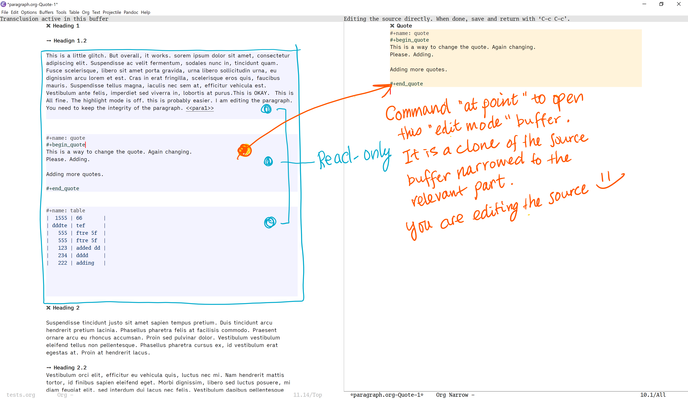

# Introduction

Transclusion is the ability to include content from one file into another by reference.


**Figure 1.**  Animation to show activation of Org-transclusion minor mode to transclude a text content under a headline in a separate org file


**Figure 2.**  Transcluding different text contents via links (left); Editing one of the sources (right)

This library is an attempt to enable transclusion with Org Mode in Emacs. It is my take on the [idea by John Kitchin](#original-idea-by-john-kitchin).

This 8-minutes show & tell on YouTube I did shows you how this library currently works.

[](https://youtu.be/hz92vaO8IgQ)

- [Demo video #4: v0.0.4: edit via indirect buffer, export, more supported link types](https://youtu.be/nO_JEXUeGkI)
- [Demo video #3: v0.0.3: headline, paragraph, Org Mode link](https://youtu.be/KxDrE3spAL8)
- [Demo video #2: v0.0.2: real-time sync](https://youtu.be/HQ0rUa7gVXA)
- [How to install video for test drive v0.0.2 alpha](https://youtu.be/c1aelYM3m9U)
- [Demo video #1: prototype](https://youtu.be/Wjk-otO2xrI)

It is still **VERY experimental**. Use it with care if you would like to play with it. It modifies your files (notes). The author and contributors cannot be held responsible for loss of important work.

If you like the idea, and can lend your technical hand, I would be grateful. Here is a [list of things](#list-of-things-to-be-done) I think needed to be done (I'm sure there are more; let me know other things, too.).

I would love your involvement if you think the idea and the current implementation look worth pursuing.

- Get involved in a discussion in [Org-roam forum](https://org-roam.discourse.group/t/prototype-transclusion-block-reference-with-emacs-org-mode/830) (the package is originally aimed for its users, me included)

- Send in pull requests

It would be great if you can work on some items on [list of things](#list-of-things-to-be-done); or add to it (we can collectively discuss additions in the forum, or perhaps in the issue)

I am writing this on 10 October 2020. I am hoping that we can have a conclusion within this year whether or not the idea and implementation are something worth pursuing collectively. Otherwise, I think it can remain my personal hobby tool.

# Intended use
I am dabbling in the Zettelkasten method, with using [Org-roam](https://www.orgroam.com/). I keep my notes in a repository where my network of notes reside (I guess people call them evergreen, concept, or permanent notes).

When I start writing something long-form, I want to have a writing project separately from my notes repository, assemble relevant notes to form a basis of the long-form material, and avoid having multiple copies of notes flying around.

Transclusion should let me do this.

# How to use the library
This screen shot with my annotation illustrates how you can edit transcluded copies.


**Figure 3.** Transclusion buffer with multiple text contents added from different sources (left); open a indirect buffer to edit one of the text content (right)

## Load
Load the file (`load-file`) or open the file and evaluate the whole buffer (`eval-buffer`). It is experimental at the moment.

As an example, I have the following in my `init.el` file.

``` emacs-lisp
(with-eval-after-load 'org
  ;; ... bunch of other org configurations ...
  ;; Org-transclusion
  (define-key global-map (kbd "<f12>") #'org-transclusion-mode))

;; ... other configurations ...

(add-hook 'org-mode-hook (lambda () (load-file "~/local-repos/org-transclusion/org-transclusion.el")))

```

## Org  Mode links
As of v0.0.4, Org Mode's standard file and ID links work.

The link must be in the beginning of a line for transclusion. If there is any character (even a space for indentation), Org-transclusion skips it.

This is to avoid transcluding links in the middle of a sentence.

Transclusion has been tested to work for the following:

- File link for an entire org file/buffer; e.g. `[[file:~/org/file.org][My Org Notes]]`
- File link with `::*heading`
- File link with `::#custom-id`
- File link with `::name` for blocks (e.g. blocked quotations) and tables
- File link with `::dedicated-target`; this is intended for linking to a paragraph. See below.
- ID link `id:uuid`
- File link for non-org files (tested with `.txt` and `.md`); for these, the whole buffer gets transcluded

### Customisable filter to exclude certain Org elements
Set customizable variable `org-transclusion-exclude-elements` to define which elements to be **excluded** in the transclusion.

The filter works for all cases when transcluding an entire Org file, and parts of an Org file (headlines, custom ID, etc.). There is no filter for non-Org files.

It is a list of symbols, and the default is `(property-drawer)`. The accepted values are the ones defined by `org-element-all-elements` (Org's standard set of elements).

How to use it is demonstrated in the [YouTube video #5](https://youtu.be/hz92vaO8IgQ) as well.

### Link to a paragraph with dedicated target
For transcluding a specific paragraph, Org-transclusion relies on Org mode's [dedicated-target](https://orgmode.org/manual/Internal-Links.html#Internal-Links). The target paragraph must be identifiable by a dedicated target with a `<<paragraph-id>>`: e.g.

    Lorem ipsum dolor sit amet, consectetur adipiscing elit.
    Suspendisse ac velit fermentum, sodales nunc in,
    tincidunt quam. <<paragraph-id>>

It is generally assumed that the paragraph-id is placed after its content, but it is not an absolute requirement; it can be in the beginning (before the content) or in the middle of it.

## Special link type (mostly) disabled
In the previous versions, Org-transclusion worked on a special link type (default value "otc:"). As of 0.0.4, it is not widely used (the support is still in the code, but there is no out-of-the-box configuration for it). Currently, standard Org Mode links are used (see the section above).

## Activate and deactivate -- `org-transclusion-mode` minor mode

Org-transclusion is a buffer-local minor mode. Use `org-transaction-mode` to toggle on and off.  When you are in an Org file where you want to transclude text content via a link, toggle it on. It is suggest that a keybinding is assigned to make it easy switch it on and off.

Below is an example configuration, which I have in my `init.el`.

``` emacs-lisp
(with-eval-after-load 'org
  ;; ... bunch of other org configurations ...
  ;; Org-transclusion
  (define-key global-map (kbd "<f12>") #'org-transclusion-mode))
```

If the customizing variable `org-transclusion-activate-persistent-message` is non-nil (default), you should see a header appear on top of the buffer indicating transclusion is active.

## Edit transcluded contents
Transcluded contents are read-only. To edit them, use `org-transclusion-open-edit-src-buffer-at-point` command. By default, it is bound to <kbd>C-c n e</kbd> in `org-transclusion-mode-map` (modify the keybinding as you prefer).

It will open an indirect buffer of the **transclusion source**; you will be editing the source directly. In the edit source buffer, there is no "abort" function. You can use undo, and other normal editing facilities. Once done, simply save, and go back by using <kbd>C-c C-c</kbd> to go back to the transclusion buffer. It is a convenience function to close the indirect buffer and return where you have come from.

## Merge different Org Mode headline levels
[Reference issue #14](https://github.com/nobiot/org-transclusion/issues/14)

An experimental feature has been merged. Now the transcluded source text content "adapts" the headline level of its subtrees to its embedded environment in the transclusion buffer. It's quite mouthful, but see the logic below. It should be the same as how refill / archive work in Org Mode (if I am not mistaken).

Logic is as follows (from documentation of `org-paste-subtree` ):

```
[... omitted ... ] [T]he new level is derived from the *visible* headings
before and after the insertion point, and taken to be the inferior headline
level of the two.  So if the previous visible heading is level 3 and the
next is level 4 (or vice versa), level 4 will be used for insertion.
This makes sure that the subtree remains an independent subtree and does
not swallow low level entries.

```

[If this feature survives incubation, I will do a bit easy-to-grasp illustration / explanation.]

Org-transclusion uses a patched version of `org-paste-subtree`, named `org-transclusion-paste-subtree`.

The experimental feature is turned on by default, and can be adjusted via `org-transclusion-use-paste-subtree` variable (non-nil, or nil).

# List of things to be done
- [ ] Validate the fundamental idea / architecture, especially modifying and saving the transclusion sources

    ~~I took the modifying logic from `org-edit-src` (`-save` and `-exit` more specifically). This may not be the best of ideas given that this part of code modifies people's notes (outcome of hard intellectual work).~~

   **Edit:** As of v0.0.4, I have implemented an alternative approach for the "copy-edit-sync" cycle -- the core of this implementation of transclusion. The transcluded copy is read-only. In order to edit it, use a function to create a clone indirect buffer of the source. As it is a clone of the source, you would be directly editting the source. The copy gets updated the next time you come back to the transcluding buffer.

   This approach has opened up new possibilities, among which is the filtering mechanism; you can exclude specified elements of the source from copied over in the corresponding transclusion (implemented in v0.0.5). I am also considering functions to adjust the headline levels of the transclusions. These functions would have been nearly impossible to implement for me, so I think I am nearly convinced that it is the best way forward. I would love to hear feedback on this.

   For the writing purpose, these flexibilities outweight the benefit of real-time sync I demonstrated with v0.0.2.

- [x] Turn the activation / deactivation into a buffer-local minor mode

  I just don't know how (yet) -- there is good in-system documentation, so it should be a matter of focus reading and playing with. If someone out there who can "just do it", that would be very helpful.

- [x] Ensure export works

  What's the point of writing up a long-form material (article, academic paper, book chapter, etc.) and you cannot export it outside Emacs? Because transclusions are "temporary copy" with just links in the files, I am not sure export functions work correctly. I am guessing Org Mode's export functions look at the buffer, so it should export the transcluded regions. I also have Pandoc Mode in mind, when you put together multiple files/buffers to form a material. This needs validation, and if it does not work, then a solution.

  **Edit:**  I tested it with Org Mode's export dispatcher, and Pandoc mode. One thing I have not tested is a batch processing of export.  Org-transclusion currently assumes that you are visiting the file.

- [x] Consider cycling "Edit" -> "Read-only" modes, perhaps?

  I think it is related to the export function. I had an idea to make the transclusions read-only as well as edit mode. When read-only mode is on, you cannot edit the transcluded content, but it will remain on the buffer even if you change the focus away from it. I think the read-only content should be removed on save hooks like the editable ones.

    **Edit:** Transclusions are read-only. You need to call a command to open an indirect buffer for editing the source of a transclusion.

- [x] Consider a good use of mode when transclusion is inactive

  I have not thought it through yet. When transclusion is inactive, you can still transclude contents manually clicking on the link. You can use `update-src`, `remove-` or `detach-at-point` commands interactively. When inactive, transclusion does not toggle, update, or save source buffers automatically.

  **Edit:** I have put in a check in `add-all-in-buffer` function that requires the minor mode to be active to add transclusions.

- [x] Make `update-at-point` accept `C-u` or something to turn on save

  I just could not work out the way to pass the optional `savebuf` argument to `org-transclusion-update-src-at-point`. I could make a wrapper command `org-transclusion-save-src-at-point`; I was not sure if that's desirable.

    **Edit:** Update/save are not relevant anymore; you edit the source via indirect buffer.
`C-u` (universal argument) is used for the open link function to behave it like a normal link.

- [ ] Make UX/UI more writer-friendly (e.g face for the overlay)

  I didn't have enough knowledge how defining faces work.
If we also have edit and read-only mode, I think it makes sense to have different colors on the overlay to indicate they are different.

    I also like the idea of using gutter (like the `git-gutter` package).

- [x] Add visual queue to the source buffer

    One of the UI/UX improvements. I think the source buffer should also visually indicate that there is an active transclusion for the buffer or element (headline). For this, using the gutter would add a subtle and yet sufficient visual indication, I think.

    Since the `org-transclusion--yank-source-to-target` visits the source buffer, it should be possible to do something with it.

    **Edit:** Need more experiments to improve the UI.

- [x] Review John Kitchin's implementation

  I was not aware of John's implementation while making my own prototype for sharing on GitHub. I would like to review what he has done.
    https://github.com/whacked/transclusion-minor-mode/blob/master/transcluding-org-elements.org

    **Edit:** Yes. `save-window-excursion` was a revelation, and enabled the new approach.
    Using the display property of overlays is not suitable for the purpose; it does not export displayed contents.

- [ ] Other things I miss

  I'm sure there are more. I would appreciate your advice.

# Original idea by John Kitchin
https://github.com/alphapapa/transclusion-in-emacs#org-mode

> {O} transcluding some org-elements in multiple places
> [2016-12-09 Fri] John Kitchin asks:
>
> I have an idea for how I could transclude “copies” or links to org-elements in multiple places and keep them up to date. A prototypical example of this is I have a set of org-contacts in one place, and I want to create a new list of people for a committee in a new place made of “copies” of the contact headlines. But I do not really want to duplicate the headlines, and if I modify one, I want it reflected in the other places. I do not want just links to those contacts, because then I can not do things with org-map-entries, and other org-machinery which needs the actual headlines/properties present. Another example might be I want a table in two places, but the contents of them should stay synchronized, ditto for a code block.
>
> This idea was inspired by https://github.com/gregdetre/emacs-freex.
>
> The idea starts with creating (wait for it…) a new link ;) In a document where I want to transclude a headline, I would enter something like:
>
> transclude:some-file.org::*headline title
>
> Then, I would rely on the font-lock system to replace that link with the headline and its contents (via the :activate-func link property), and to put an overlay on it with a bunch of useful properties, including modification hooks that would update the source if I change the the element in this document, and some visual indication that it is transcluded (e.g. light gray background/tooltip).
>
> I would create a kill-buffer hook function that would replace that transcluded content with the original link. A focus-in hook function would make sure the transcluded content is updated when you enter the frame. So when the file is not open, there is just a transclude link indicating what should be put there, and when it is open, the overlay modification hooks and focus hook should ensure everything stays synchronized (as long as external processes are not modifying the contents).
>
> It seems like this could work well for headlines, and named tables, src blocks, and probably any other element that can be addressed by a name/ID.
