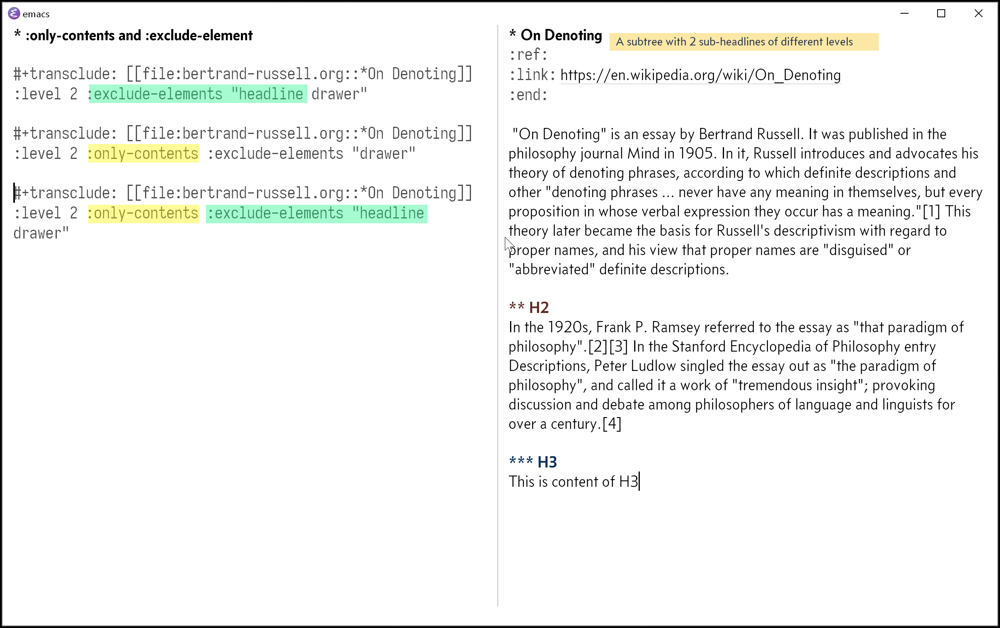
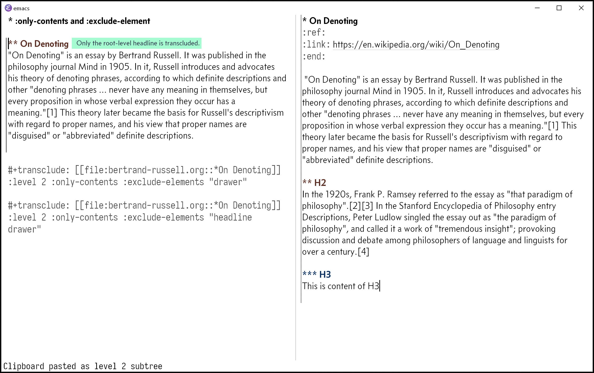
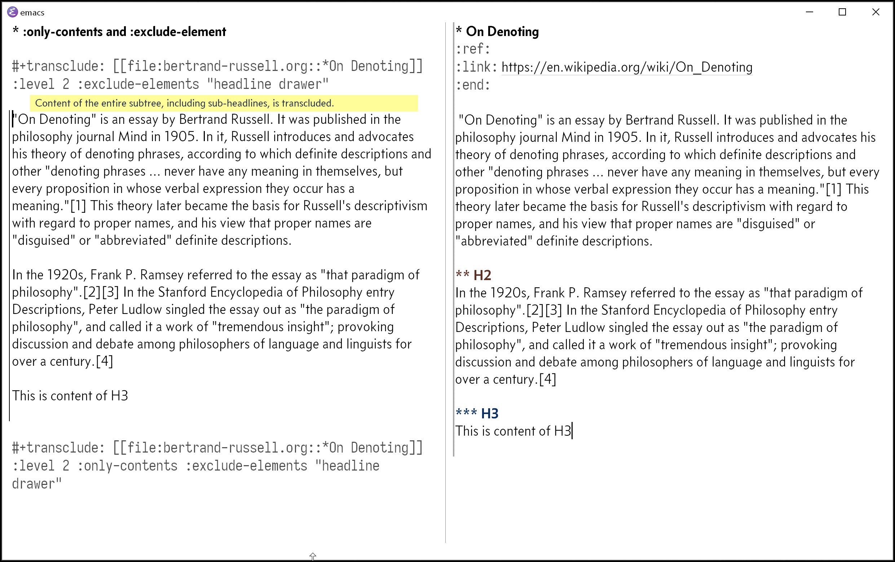
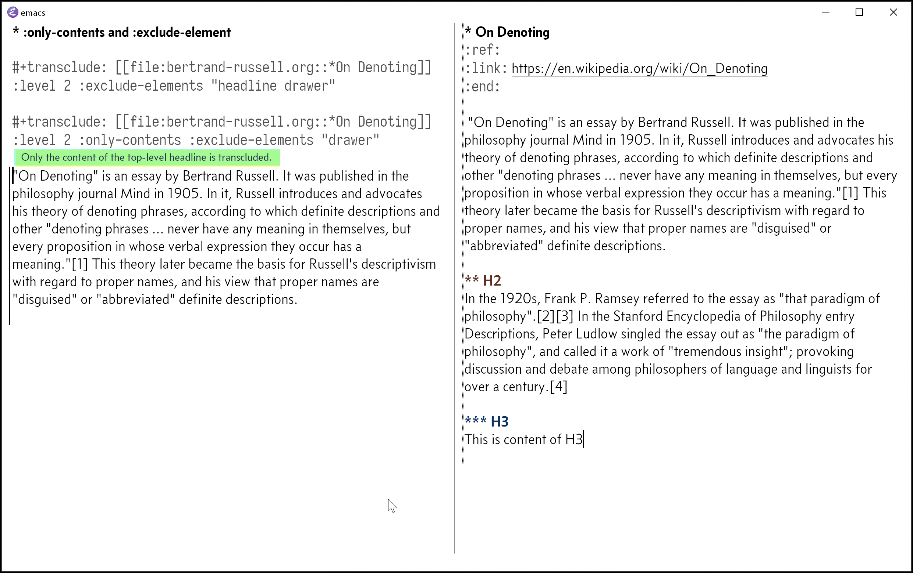

# Breaking Changes
 
 For users of previous releases, there will be some “breaking” changes that come with the new features in addition to to improvements under the hood.
 
 1. New names for commands
 2. Slight simplification of the syntax of the `#+transclusion` keyword.

Please refer below for detail of each item and see if you will need to adapt your Emacs to the new version, and if so, a quick note on how you might go about it. Please let me know if you have any questions.

I understand that these “breaking” changes that impact you as a user must be minimized. I feel much more comfortable with the syntax and feature set that Org-transclusion provides as of this version. It will likely stay more stable where it matters to you than it has previously been so far. I don’t feel a need for major changes to the syntax and existing features that impact you until I propose Org-transclusion for inclusion in the upstream Org Mode—that’s something I have been planing to do hopefully in the latter half of 2021. Until then, of course, I have plans for new features (refer to Road Map after v0.2.0 section below for the current plan).
  
## New Command Names

The names of commands will be shorten as the table below. The prefix "org-transclusion" is already quite long, and I have been feeling that the names of the functions and variables in Org-transclusion are too verbose. I have taken this opportunity to standardize them.

Please adapt your keybindings or custom functions accordingly. If you don’t have custom keybindings or functions that use the commands in the list, you don’t have do anything.

| New                                | Old                                         |
|------------------------------------|---------------------------------------------|
| `org-transclusion-add`             | `org-transclusion-add-at-point`             |
| `org-transclusion-add-all`         | `org-transclusion-add-all-in-buffer`        |
| `org-transclusion-remove`          | `org-transclusion-remove-at-point`          |
| `org-transclusion-remove-all`      | `org-transclusion-remove-all-in-buffer`     |
| `org-transclusion-refresh`         | `org-transclusion-refresh-at-point`         |
| `org-transclusion-live-sync-start` | `org-transclusion-live-sync-start-at-point` |
| `org-transclusion-live-sync-exit`  | `org-transclusion-live-sync-exit-at-point`  |
| `org-transclusion-move-to-source`  | Not applicable; new command                 |

Essentially, "at-point" and "in-buffer" will be dropped; the new names will imply these qualifiers. In addition, "all-in-buffer" will no longer be precisely correct; with this version, you will be able to control whether or not you add/remove transclusions only within the visible part of the buffer when narrowed. The default behavior will be to temporarily widen the buffer to work on the entire buffer.

## Slight simplification of the `#+transclusion` syntax

The new version will drop the initial `t` or `nil` value of `#+transclusion`. If you have custom functions that add them (e.g. capture template), please adjust them accordingly.

Please feel assured that keeping a `t/nil` value will not error in the new version. When you add and remove a transclusion, the value is simply dropped.
 
In place of a `t/nil` value, Org-transclusion will support the `:disable-auto` property. It does not need a value. The syntax will be like this example below.

    #+transclude: [[file:path/to/file.org]] :disable-auto

When a transclusion keyword has this property, `org-transclusion-add-all` will ignore it. It will not affect the manual transclusion at point with `org-transclusion-add`.
 
# New Features

You will be able to use the following additional properties with the `#+transclude` keyword. They will enable you to add additional filters for each transclusion different to one another:

`:contents-only`, `:exclude-elements`, and `:disable-auto`
 
`:contents-only` will let you exclude headlines' titles when you transclude a subtree (headline). When the subtree contains subheadlines, all the contents will be transcluded by default. 
 
The existing customizing variables `org-transclusion-exclude-elements` will remain; the `:exclude-elements` property will add additional fine-tuning per transclusion.

You can combine `:contents-only` and `:exclude-elements` to control how you transclude a subtree.

 
**Figure 1**. *Left*. Three transclusions with different properties; *Right*. Source to be transcluded

 
**Figure 2**. *Left*. Only the root-level headline is transcluded

**Figure 3**. *Left*. Content of the entire subtree, including sub-headlines, is transcluded

**Figure 3**. *Left*. Combined; only the content of top-level headline is transcluded

 We have talked about `:disable-auto` above. When added to a transclusion,  `org-transclusion-add-all` will skip it. Manual transclusion with using  `org-transclusion-add` will not be affected.
 
# Road Map after v0.2.0
 
I have two things currently in the works.
 
1. Better support for non-Org text files, especially source code files.
2. Support for more Org elements

## Better Support for source files and other non-Org files

I would like it to be the next feature to be added. I have already done some work on it, and it is looking promising.

I don’t see it will require breaking changes. Provided that it will not hit any major issues, it will likely be for v0.2.1.

## Support for More Org Elements.

Currently transclusion works for a select Org elements. It works for headlines, tables, quote-blocks, and paragraphs; but notably it does not work
for other blocks.

In the background, I am doing some prototyping to see I could support all the other elements. An early result looked good. If this pans out well, the improvement will be done under the hood; no impact on you as users. It’s still an early stage so I will need to spend more time on this.

I will be taking some weeks off in the latter half of June. There will be more coming in the summer of 2021. Stay safe, and stay tuned :)
